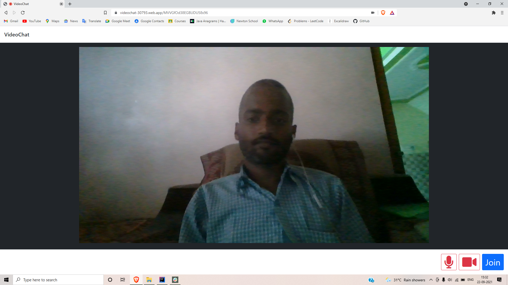
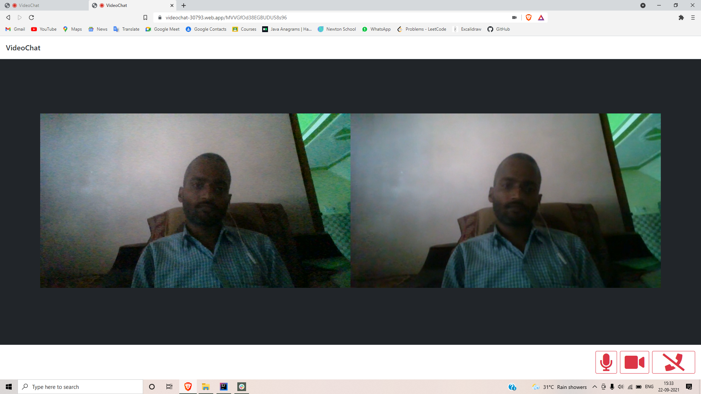

# Video Chat web app

This is one to one simple video chat application 
which is browser based on webrtc and google 
firebase console.

## Tech stack
- HTML 
- CSS
- Bootstrap 
- JavaScript
- Google firebase console

## Feature  
- Peer to peer connection
- One to one video call

## Screenshots

## Links
[Website](https://videochat-30793.web.app)  
[Documentation](https://github.com/rp875638/OnlineNote#readme)  
[Source code](https://github.com/rp875638/OnlineNote)